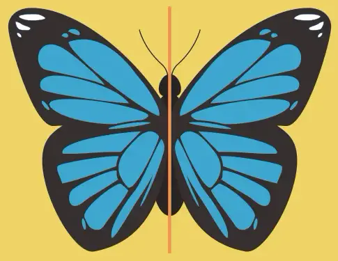
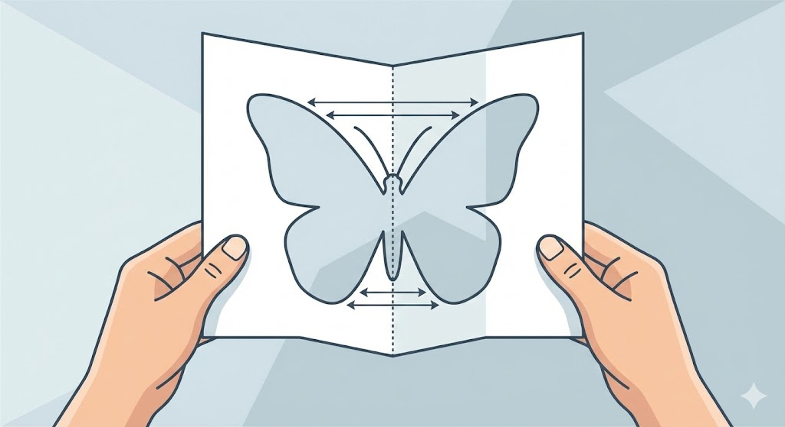
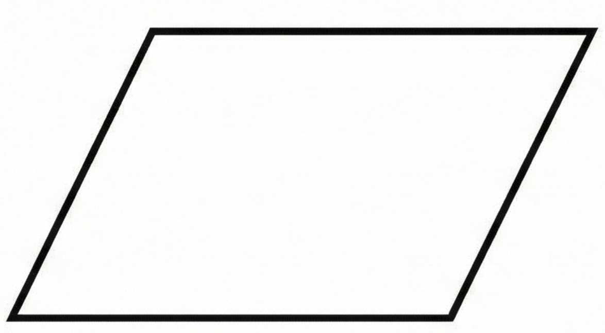
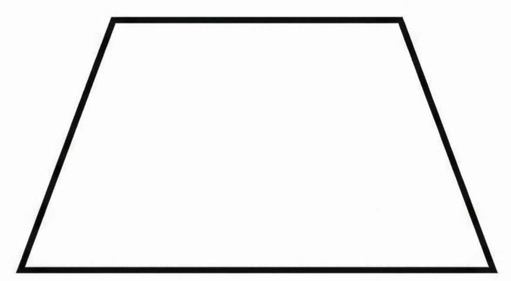
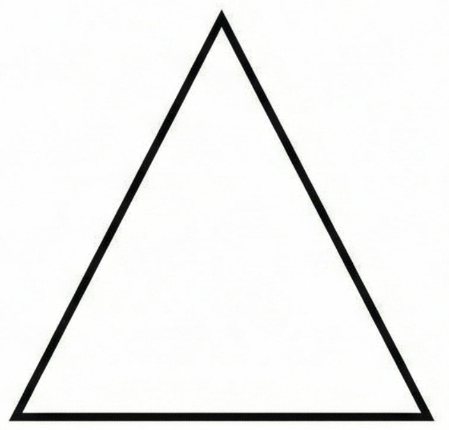
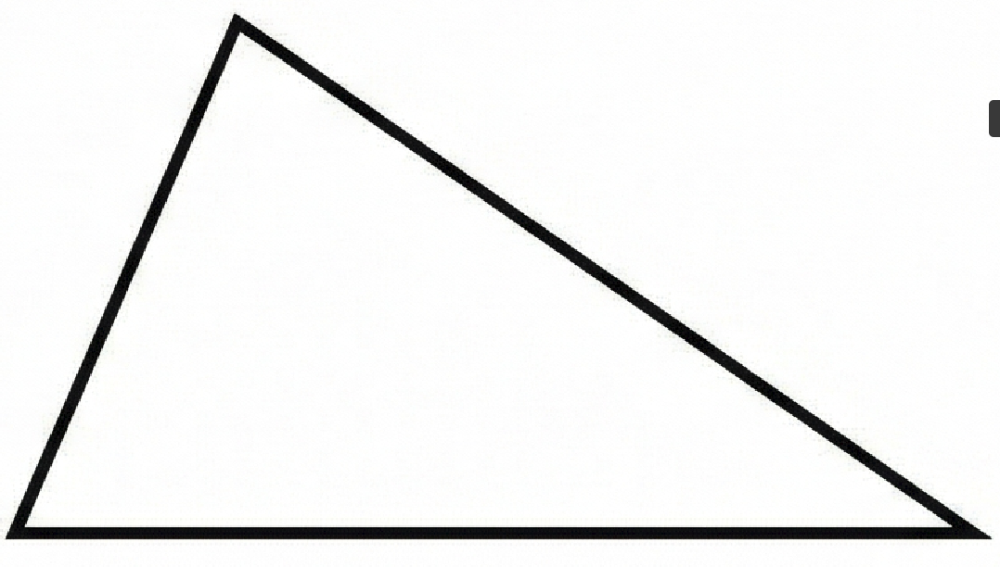
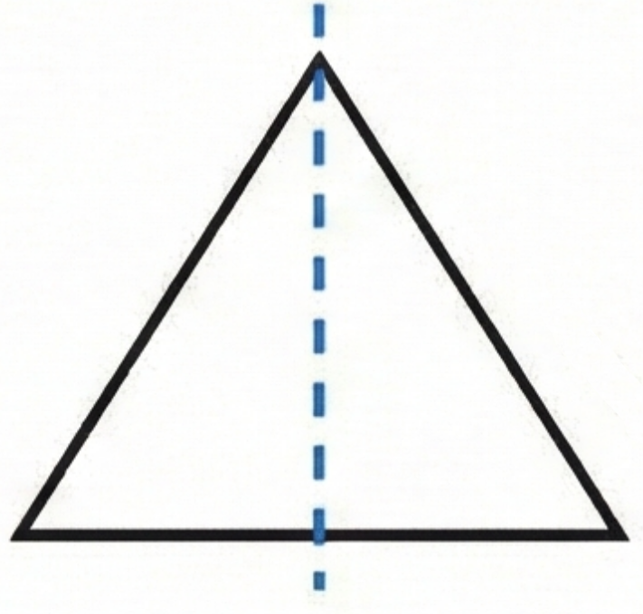
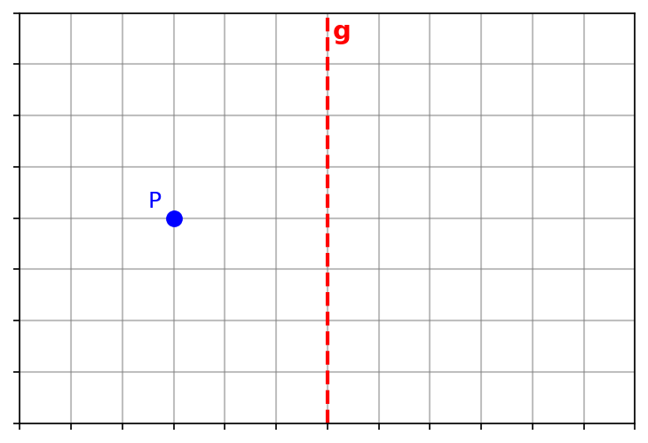
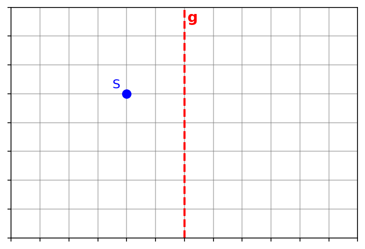
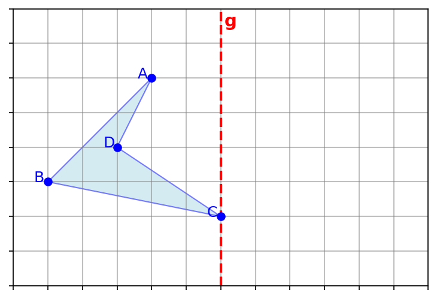

# Unser Ziel heute
Wir lernen, wie man Figuren an einer Geraden spiegelt und benutzen dabei die richtigen Fachbegriffe.

 

Falte dein Blatt einmal und erstelle ein einfachen Scherenschnitt!

---

# Fachbegriff 1
Achsensymmetrie

Wenn wir eine Figur falten können und beide Hälften decken sich genau, nennen wir das **Achsensymmetrie**.

 

---

# Fachbegriff 2
Deckungsgleich

Wenn zwei Figuren genau übereinander passen, sind sie **deckungsgleich**.

---

# Entscheidung
Ist die Figur achsensymmetrisch?

---

# Entscheidung
Ist die Figur achsensymmetrisch?

---

# Entscheidung
Ist die Figur achsensymmetrisch?

---

# Entscheidung
Ist die Figur achsensymmetrisch?

---

# Entscheidung
Ist die Figur achsensymmetrisch?

---

# Entscheidung
Ist die Figur achsensymmetrisch?

---

# Zusammenfassung

Schreibe in deinen Hefter!

## Achsensymmetrie

**Merke:**

Eine Figur, die man entlang einer Gerade so falten kann, dass die beiden Teile deckungsgleich sind, nennt man **achsensymmetrisch**.

Die Gerade heißt **Symmetrieachse**.

---

# Beobachte
Ich spiegele einen Punkt.

---

# Beobachte
Ich spiegele den Punkt.

---

# Ich mache es vor
Ich spiegele das Viereck $ABCD$ an der Achse $g$.

---

# Übungsphase
Jetzt seid ihr dran :)

**Buch S. 152 Nr. 3**

---

# Ich mache es vor
Spiegeln mit dem Geodreieck

---

# Übungsphase
Jetzt seid ihr dran :)

**Buch S. 152 Nr. 4**

