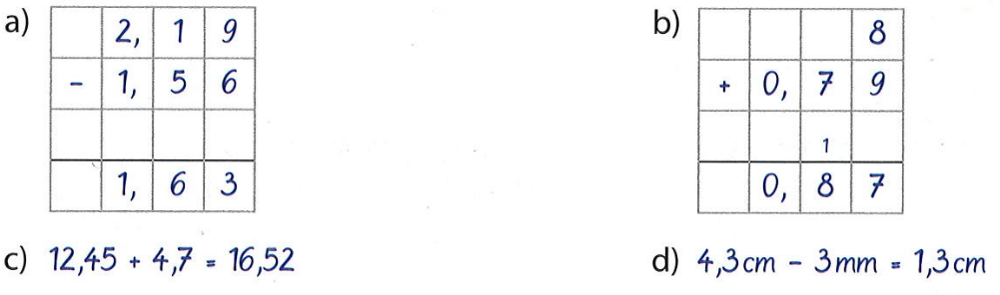

# Startaufgabe
Löse die Aufgaben still für dich.

a) Berechne schriftlich: $1145 + 236$

 

b) Welchen Stellenwert ist markiert? $12,4\underline{5}$?

c) Runde $3,72$ auf **Zehntel**.

 

d) Schreibe $\frac{7}{100}$ als Kommazahl.

---

# Lösungen
Vergleiche und korrigiere.

* a) $1145 + 236 =$ ++**$1381$**++
* b) $12,4\underline{5} \rightarrow$ ++**Hundertstel (h)**++
* c) $3,72 \approx$ ++**$3,7$** (abrunden)++
* d) $\frac{7}{100} =$ ++**$0,07$**++

---

# Diagnose
Welche Schreibweise ist richtig?

Wir wollen rechnen: $12,5 + 3,48$.

**A)**

$$\begin{array}{r}
\phantom{+}12,5\\
+\phantom{1}3,48\\
\hline
\end{array}$$

**B)**

$$\begin{array}{r}
\phantom{+}12,50\\
+\phantom{1}3,48\\
\hline
\end{array}$$

 

*Entscheide dich und lege dann deinen Kopf auf *einen* Arm! Der andere Arm kommt hinter deinen Kopf.*

---

# Auflösung
Komma unter Komma!

**Richtig ist B!**

 

**A)**

$$\begin{array}{r}
\phantom{+}12,5\\
+\phantom{1}3,48\\
\hline
\end{array}$$

**B)**

$$\begin{array}{r}
\phantom{+}12,50\\
+\phantom{1}3,48\\
\hline
\end{array}$$

* **A** ist falsch, weil die Kommas nicht übereinander stehen.
* **B ist richtig**, weil das **Komma genau unter dem Komma** steht.

---

# Vorbereitung
Das Auffüllen

* Bevor wir rechnen, machen wir die Zahlen oft **gleich lang**.
* Wir füllen leere Plätze am Ende mit einer **Null** auf.

 

* Beispiel:
* $3,5$ und $3,42 \rightarrow$ Wir machen aus $3,5$ ein **$3,50$**.

---

# Kurz-Check
Auf euren Whiteboards

Fülle die Lücken mit Nullen auf, sodass beide Zahlen gleich viele Nachkommastellen haben.

 

* a) $4,2$ und $1,75 \rightarrow$ ++$4,2\mathbf{0}$ und $1,75$++

 

* b) $12$ und $3,4 \rightarrow$ ++$12,\mathbf{0}$ und $3,4$++

---

# Ich mache es vor
Stifte weglegen und beobachten. Ich rechne: $14,3 + 5,92$

* **Schritt 1:**
* Ich schreibe die Zahlen:  **Komma unter Komma**!

* **Schritt 2:**
* Ich fülle leere Stellen mit **Nullen** auf.

* **Schritt 3:**
* Ich addiere ganz normal. Das Komma im Ergebnis bleibt an der gleichen Stelle!

---

# Wir machen es gemeinsam
Auf euren Whiteboards

**Beispiel**

$$\begin{array}{r}
\phantom{+}14,30\\
+\phantom{1}5,92\\
\scriptsize 1 \phantom{1} 1 \phantom{1111} \\
\hline
20,22
\end{array}$$

 

$\phantom{0}$

**Du bist dran:**
$23,4 + 6,85$

 
 

❶ Schreibe untereinander (Komma unter Komma!).
❷ Fülle die Lücke mit einer Null.
❸ Berechne.

---

# Lösung
Zeigt mir eure Whiteboards!

$$\begin{array}{r}
\phantom{+}23,4\mathbf{0}\\
+\phantom{1}6,85\\
\scriptsize 1 \phantom{1111} \\
\hline
30,25
\end{array}$$

---

# Achtung bei Minus!
Unbedingt Null auffüllen!

Bei der Subtraktion (Minus) ist das Auffüllen der Null **lebenswichtig**!

Aufgabe: $12 - 3,4$

 

$$\begin{array}{r}
12\phantom{,0}\\
-\phantom{1}3,4\\
\hline
\end{array}$$

---

# Auf euren Whiteboards!
Stellengerecht untereinander schreiben & rechnen!

Denke an die **Null**!

* a) $8,5 + 2,13$

* b) $15,4 - 3,12$

* c) $9 - 0,4$  *(Achtung: Wo ist das Komma bei der 9?)*

---

# Lösungen
Vergleiche genau.

**a)**
$$\begin{array}{r}
\phantom{+}8,5\mathbf{0}\\
+\phantom{1}2,13\\
\hline
10,63
\end{array}$$

**b)**
$$\begin{array}{r}
\phantom{+}15,4\mathbf{0}\\
-\phantom{1}3,12\\
\hline
12,28
\end{array}$$

**c)**
$$\begin{array}{r}
\phantom{+}9,\mathbf{0}\\
-\phantom{1}0,4\\
\hline
8,6
\end{array}$$

---

# Übungsphase
In euren Heftern

* ## Buch S. 106 / 1 und 2  (je 4 Aufgaben aussuchen!)
* ## Buch S. 107 / 3 und 4  (je 3 Aufgaben aussuchen!)

---

# Verständnisfrage
Was denkst du?

---

# Übungsphase
In euren Heftern

* ## Buch S. 108 Nr. 14

