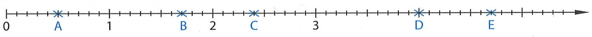
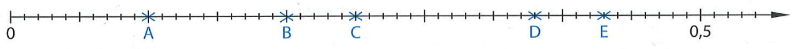
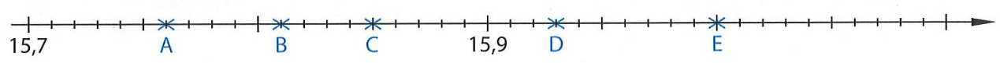

# Auf euren Whiteboards
Wie heißt der **Stellenwert** der unterstrichenen Ziffer?

Schreibe: z, h, t oder zt!

*  a) $3,4\underline{7}1$

*  b) $3,47\underline{1}$

*  c) $75,\underline{1}23$

*  d) $2,789\underline{6}$

---

# Lösungen
Zeigt mir eure Whiteboards!

*   a) $3,4\underline{7}1$ → ++Hundertstel (h)++
*   b) $3,47\underline{1}$ → ++Tausendstel (t)++
*  c) $75,\underline{1}23$ → ++Zehntel (z)++
*  d) $2,789\underline{6}$ → ++Zehntausendstel (zt)++

---

# Merke
Strategie: Die Leserichtung

Wenn wir Dezimalzahlen vergleichen, schauen wir uns die Ziffern immer in einer bestimmten Richtung an.

 

++$\huge \rightarrow$++

 

* Wir vergleichen immer von **links** nach **rechts**.

---

# Beispiel
Beobachte genau: Wann entscheide ich?

**Beispiel 1:**

$$3,\mathbf{5}2$$
$$3,\mathbf{2}9$$

 

* Ich vergleiche die **Zehntel**.
* $5 > 2$
* also: $3,52 > 3,29$

**Beispiel 2:**

$$3,5\phantom{0}$$
$$3,5\mathbf{2}$$

 

* Ich vergleiche die **Hundertstel**.
* $0 < 2$
* also: $3,5 < 3,52$

---

# Auf euren Whiteboards
An welcher Stelle (z,h,t) unterscheiden dich sich die Zahlen **zuerst**?

* a) $4,1 \quad \text{und} \quad 4,8$

* b) $4,1 \quad \text{und} \quad 4,15$

* c) $0,123 \quad \text{und} \quad 0,124$

---

# Lösungen
Zeigt mir eure Whiteboards!

* a) $4,\mathbf{1} \quad \text{und} \quad 4,\mathbf{8} \quad \text{(Zehntel)}$

 

* b) $4,1 \quad \text{und} \quad 4,1\mathbf{5} \quad \text{(Hundertstel)}$
  *(Vergleich mit der leeren Stelle)*

 

* c) $0,12\mathbf{3} \quad \text{und} \quad 0,12\mathbf{4} \quad \text{(Tausendstel)}$

---

# Auf euren Whiteboards
Welche Zahl ist größer? Setze das richtige Zeichen: < oder >

$$7,56 \quad ? \quad 7,53$$

---

# Lösung
Zeigt mir eure Whiteboards!

$$7,5\underline{6} \quad \mathbf{>} \quad 7,5\underline{3}$$

 

* *Weil 6 Hundertstel größer sind als 3 Hundertstel.*

---

# Beispiel
Komplexe Zahlen vergleichen

Ich vergleiche **5,42** und **5,418**.
Ich schreibe sie untereinander (Komma unter Komma).

| E | , | z | h | t |
| :---: | :---: | :---: | :---: | :---: |
| 5 | , | 4 | 2 | |
| 5 | , | 4 | 1 | 8 |

* Einer: $5 = 5$ (gleich) $\rightarrow$ weiter nach rechts.
* Zehntel: $4 = 4$ (gleich) $\rightarrow$ weiter nach rechts.
* Hundertstel: **$2 > 1$**

* Ergebnis: ++$5,42 > 5,418$++

---

# Auf euren Whiteboards
Vergleiche!

Vergleiche auf deinem Whiteboard: **3,06** und **3,064**

1. Schreibe sie korrekt untereinander.
2. Finde die erste Stelle, die unterschiedlich ist.
3. Setze das Zeichen ($<, >$).

---

# Lösung
Zeigt mir eure Whiteboards!

| E | , | z | h | t |
| :---: | :---: | :---: | :---: | :---: |
| 3 | , | 0 | 6 | $\phantom{0}$ |
| 3 | , | 0 | 6 | 4 |

 

*  Einer, Zehntel und Hundertstel sind gleich.
*  Tausendstel: "Nichts" ($0$) ist kleiner als $4$.
*  ++$3,06 < 3,064$++

---

# Zusammenfassung

* Wir vergleichen immer stellenweise von **links nach rechts**.
* Wir schreiben die Zahlen am besten **untereinander** (Komma unter Komma).
* Die **erste Stelle**, an der sich die Ziffern unterscheiden, entscheidet, welche Zahl größer ist.
* **Achtung:** Eine Zahl mit mehr Nachkommastellen ist **nicht** automatisch größer! (Beispiel: $5,42 > 5,418$)

* **Buch S. 97 / 1, 4, 5 (Zusatz 3)**

---

  # Dezimalzahlen darstellen
  am Zahlenstrahl

---

  # Auf euren Whiteboards
  Lies die markierten Zahlen ab!

---

# Lösung
Zeigt mir eure Whiteboards!

A = 0,5

B = 1,7

C = 2,4

D = 4

E = 4,7

---

  # Auf euren Whiteboards
  Lies die markierten Zahlen ab!

---

# Lösung
Zeigt mir eure Whiteboards!

A = 0,1

B = 0,2

C = 0,25

D = 0,38

E = 0,43

---

  # Auf euren Whiteboards
  Lies die markierten Zahlen ab!

---

# Lösung
Zeigt mir eure Whiteboards!

A = 15,76

B = 15,81

C = 15,85

D = 15,93

E = 16

---

  # Übungsphase
  In euren Heftern!

**Buch S. 98 Nr. 7**
**Buch S. 99 Nr. 9a; 12; 13**

**Zusatz: Buch S. 100 Nr. 18a; 21**
