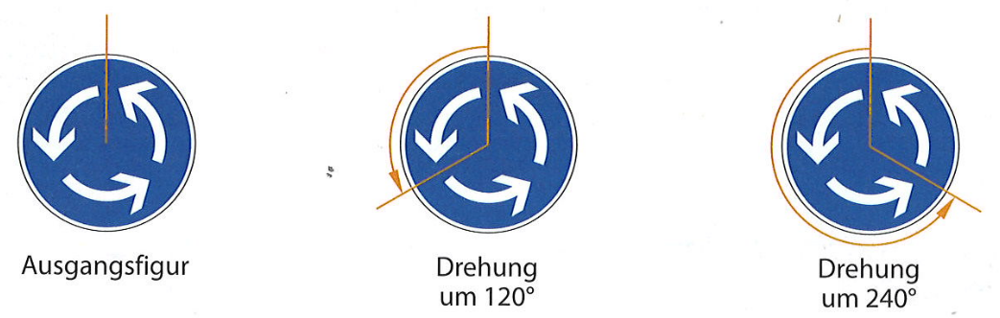
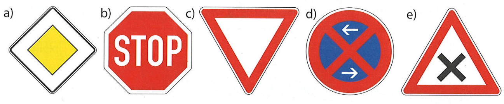
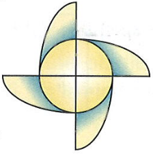
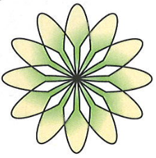
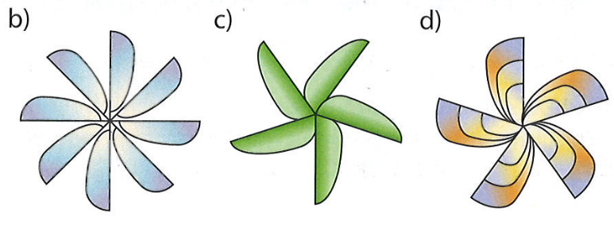
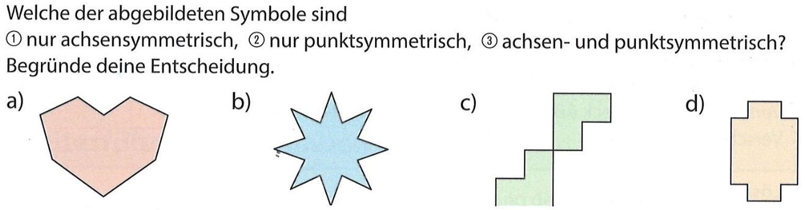
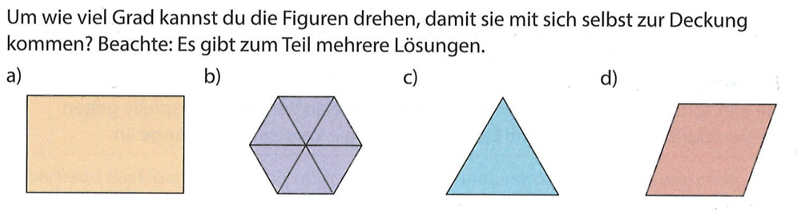
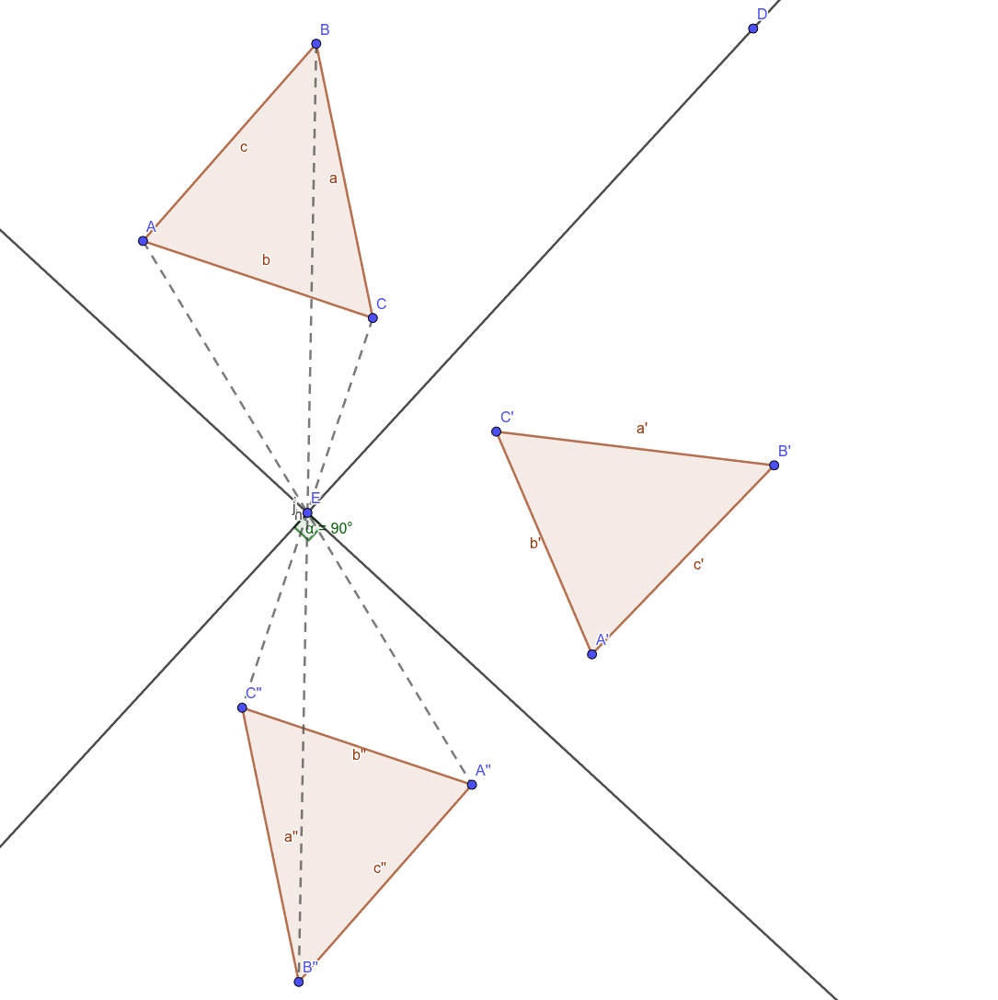

# Merke
Was ist Drehsymmetrie?

Eine Figur ist **drehsymmetrisch**, wenn sie durch Drehung um einen Winkel (der **Drehwinkel**) um einen Punkt (das **Drehpunkt $Z$**) wieder mit sich selbst in Deckung kommt.

 

---

# Mit eurem Partner!
👥 Welche Verkehrsschilder sind drehsymmetrisch?

* a) Ja
* b) Nein
* c) Ja

* d) Ja
* e) Nein

---

# Ich mache es vor
Drehwinkel finden

* Wie oft kann ich drehen? ++4 mal++
* Ich rechne: ++$360^\circ : 4 = 90^\circ$++
* kleinster Drehwinkel: ++$90^\circ$++

---

# Noch ein Beispiel
Drehwinkel finden

* Wie oft kann ich drehen? ++12 mal++
* Ich rechne: ++$360^\circ : 12 = 30^\circ$++
* kleinster Drehwinkel: ++$30^\circ$++

---

# Mit eurem Partner!
👥 Wie oft kannst die Figur drehen?

* b) 8x → 360° : 8 = 45°
* c) 5x → 360° : 5 = 72°

* d) 5x → 360° : 5 = 72°

---

# Ich mache es vor 
Eine Drehspiegelung durchführen

---

# Übungsphase
📘 In euren Heftern!

* ## Buch S. 160 Nr. 3; 4

---

# Frage

---

# Frage

---

# Frage
Stimmt das?

Sandra ist der Meinung, dass man eine Punktspiegelung durch zwei Geradenspiegelungen ersetzen kann. Hat sie recht? Begründe!

* 