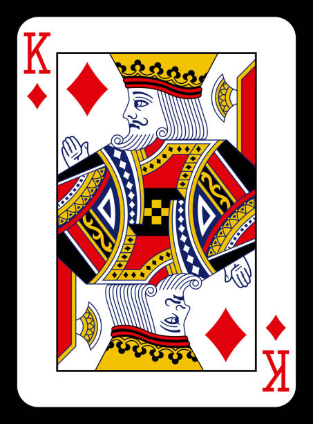
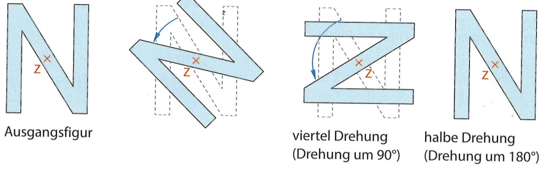
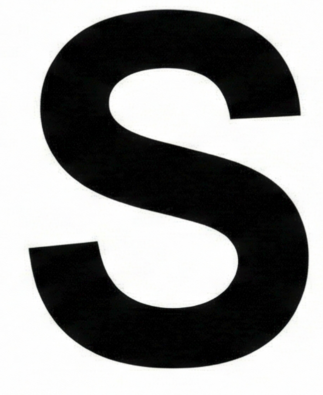
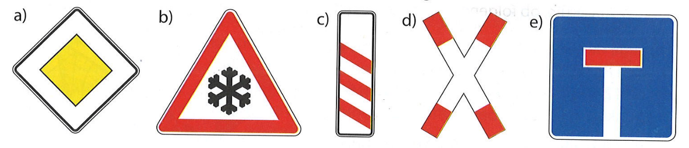
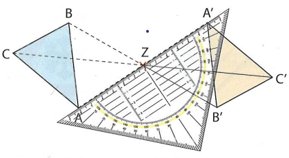
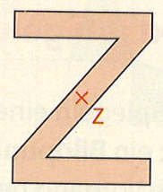

# Einstieg
👥 Ist die Figur symmetrisch?

---

# Merke
Was ist Punktsymmetrie?

Eine Figur ist **punktsymmetrisch**, wenn sie nach einer **halben Drehung (180°)** genau auf sich selbst passt.

 

---

# Auf euren Whiteboards
Entscheidung: Punktsymmetrisch? (Ja / Nein)

* a) Ein Quadrat

* b) Der Buchstabe **S**

* c) Ein gleichschenkliges Dreieck

* d) Ein Kreis
* 

---

# Lösungen
Zeigt mir eure Whiteboards!

* a) Quadrat $\rightarrow$ ++**Ja**++

 

* b) Buchstabe **S** $\rightarrow$ ++**Ja**++

* c) Dreieck (gleichsch.) $\rightarrow$ ++Nein++

 

* d) Kreis $\rightarrow$ ++**Ja**++
* 

---

# Auf euren Whiteboards
Entscheidung: Punktsymmetrisch? (Ja / Nein)

* a) ++Ja++
* b) ++Nein++
* c) ++Nein++

* d) ++Ja++
* e) ++Nein++

---

# Fachbegriff
Symmetriezentrum

Der Punkt, an dem wir spiegeln (oder drehen), hat einen festen Namen.

Es ist das **Symmetriezentrum** (meistens $Z$).

 

---

# Ich mache es vor 
Einen Punkt spiegeln

---

# Auf euren Whiteboards 
Spiegele den Punkt!

Markiere einen Punkt $A$ und ein Symmetriezentrum $Z$ (ca. 5 cm Abstand).

 

**Spiegele $A$ an $Z$!**

1. Linie durch $Z$ ziehen.
2. Abstand messen und übertragen.
3. Punkt $A'$ nennen.

---

# Kontrolle
Zeigt mir eure Whiteboards!

Überprüfe bei deinem Nachbarn:
* Ist die Linie gerade?
* Ist der Abstand $\overline{AZ}$ gleich groß wie $\overline{ZA'}$?
* Heißt der neue Punkt $A'$?

---

# Ich mache es vor 
Eine Figur spiegeln

Ich spiegele das Dreieck $ABC$ am Symmetriezentrum $Z$.

* Ich spiegele **jeden Eckpunkt einzeln** ($A \to A'$, $B \to B'$, $C \to C'$).
* Am Ende verbinde ich $A'$, $B'$ und $C'$.

---

# Zusammenfassung
Schreibe in deinen Hefter!

**Merke:**
Eine Figur ist **punktsymmetrisch**, wenn sie durch eine halbe Drehung auf sich selbst abgebildet wird. Der Drehpunkt heißt **Symmetriezentrum** ($Z$).

---

# Übungsphase
📘 In euren Heftern!

* ## Buch S. 157 Nr. 4; 5; 7

